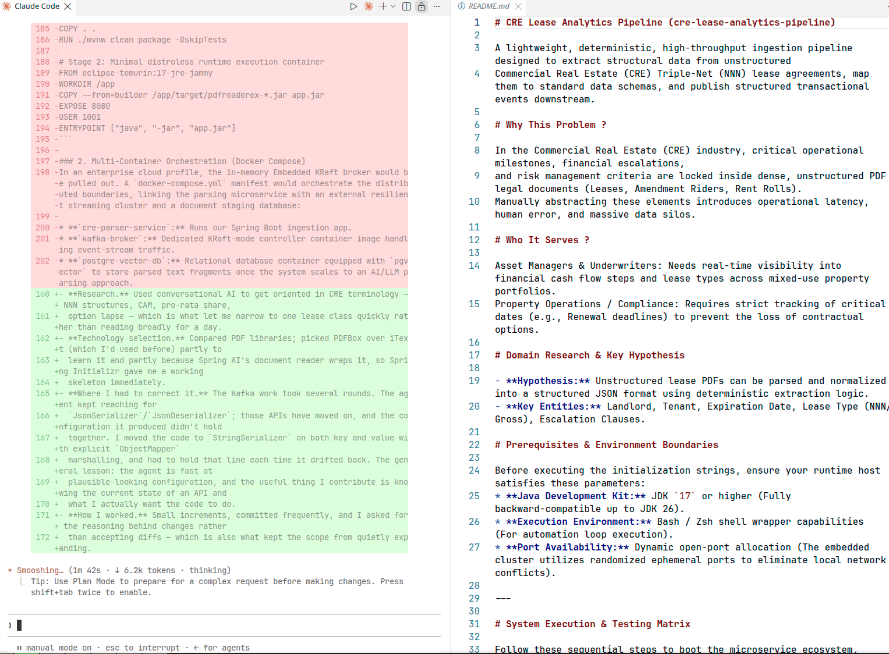

# CRE lease abstraction service

This service extracts three fields from Commercial Real Estate (CRE) Triple-Net (NNN) lease PDFs — landlord,
tenant, and lease expiration date — and returns them as JSON over HTTP. A test-level Kafka simulation
demonstrates how an extracted record travels to downstream consumers.

The project took about two days. The scope covers one narrow slice of a real problem, working end to end,
rather than a broader prototype that demonstrates partially.

## The problem and who it serves

In CRE, the operational facts of a tenancy are stored in PDF legal documents that aren't machine-readable: who
the counterparties are, when the term ends, when a renewal option lapses, and how rent escalates. Analysts
abstract these facts by hand. The work is slow, it varies between analysts, and it creates one specific costly
failure — a renewal notice deadline passes unnoticed and the tenant loses a contractual option.

The people affected are lease administrators and asset managers who maintain a portfolio rent roll. They need
the same small set of fields from every incoming lease, reliably, in a form they can load into an existing
system of record.

This service addresses the narrowest useful version of that problem: read a lease PDF, extract the
counterparties and the expiration date, and emit them as a structured record.

## Research findings and how I scoped the work

Lease documents look more standard than they are. Every landlord writes their own version, so the same fact can
carry a different label, sit in a different section, or appear only inside a sentence of legal text instead of in
a table. I focused on NNN leases, where the tenant pays taxes, insurance, and maintenance on top of the rent,
because they're common and follow a fairly regular layout.

I read `sample1.pdf`, a representative third-party lease that shows following fields that a document of this kind would typically contain:

| Field                               | Location in the document                                                                                        | Extracted |
| ----------------------------------- | --------------------------------------------------------------------------------------------------------------- | --------- |
| Landlord / Lessor                   | Summary table, labeled                                                                                          | Yes       |
| Tenant / Lessee                     | Summary table, labeled                                                                                          | Yes       |
| Lease expiration date               | Summary table, restated in section 1.3 prose                                                                    | Yes       |
| Commencement date                   | Summary table, restated in section 1.1 prose                                                                    | No        |
| Renewal notice deadline             | Section 4.1, prose only: "no later than one hundred and eighty (180) days prior to the initial Expiration Date" | No        |
| Rent escalation schedule            | Section 2.1, a five-tier table from $30.00 to $33.76 per square foot over 60 months                             | No        |
| Pro-rata share                      | Section 3.1, prose: "calculated at exactly 12.5% of the total asset building area"                              | No        |
| Net rentable area                   | Summary table                                                                                                   | No        |
| Lease structure type (NNN or gross) | Summary table                                                                                                   | No        |

I built the first three fields (to showcase the PDF extraction workflow). This is the main scoping decision in the project.

The three fields I built sit in the lease's summary table, where the label and its value are on the same line.
That makes them straightforward to find with a text pattern. Extracting rest would add more work:

- The renewal notice deadline is spelled out in words, "one hundred and eighty (180) days," in the middle of a
  sentence. The same sentence also mentions a 36-month renewal term, so you have to work out which number is the
  one you want. And it's only useful once you subtract it from the expiration date.
- The rent escalation schedule is a five-row table. When a PDF is read as plain text, the rows and columns run
  together.
- The pro-rata share appears only in a sentence, not in the table.

Each of those is its own project, not one more text pattern. Therefore, I focused mostly on 3 rows. Once I finalized the fields, I could also create a couple of other sample files to test few variances.

The renewal notice deadline is the most significant omission, because it maps directly to the costly failure
described earlier. It's first in [What to build next](#what-to-build-next).

## What I built

- `PDFDocumentReader` wraps the Spring AI `PagePdfDocumentReader`, which uses Apache PDFBox, and converts a PDF
  into page-level `Document` objects.
- `DeterministicLeaseParser` joins the pages and applies labelled regular expressions to produce a `LeaseData`
  record.
- `PDFReaderController` exposes `GET /pdfreader/parse`, composes the two services, and returns JSON.
- `PDFGeneratorUtility` generates the synthetic lease variants `sample2` and `sample3`, so the tests run against
  more than one document shape. `sample1` is a real lease and isn't generated.
- `RealLeasePdfParsingTest` parses all three sample PDFs through the same reader the service uses, so the tests
  cover what PDFBox actually returns rather than a hand-written approximation of it.
- `LeaseStreamingSimulationTest` starts an in-memory Kafka broker, publishes an extracted record, consumes it,
  and asserts that the record survives the round trip.

Kafka runs in tests only. The application doesn't wire a producer, so the streaming leg demonstrates that the
extracted record is publishable and that the contract holds.

## Run the service

Prerequisites: JDK 17 or later.

1. Start the service:
   
   ```bash
   ./mvnw spring-boot:run
   ```
   
   The service listens on port 8080.

2. In a second terminal, parse a lease:
   
   ```bash
   curl "localhost:8080/pdfreader/parse?file=sample1"
   ```
   
   The service responds with the extracted fields:
   
   ```json
   {"expirationDate":"September 30, 2031",
    "landlord":"Apex Commercial Holdings LLC",
    "tenant":"Nexus Software Solutions Inc."}
   ```

3. To parse all three samples in sequence, run the sweep script:
   
   ```bash
   src/main/resources/scripts/runtests.sh
   ```
   
   The script requires a running service. To parse an individual document, pass `sample1`, `sample2`, or
   `sample3` to the `file` parameter.


## Run the tests

To run the full suite, which includes the parser unit tests and the Kafka simulation:

```bash
./mvnw clean test
```

To run a single test class:

```bash
./mvnw test -Dtest=DeterministicLeaseParserTest
```

### Run the Kafka streaming simulation

`LeaseStreamingSimulationTest` simulates the downstream half of the pipeline. It starts a lightweight Kafka
broker in KRaft mode in memory on an ephemeral port (dynamic), serializes a `LeaseData` record to JSON, publishes it to
the `cre-lease-events` topic, consumes it from a listener, deserializes it, and asserts the data to make sure no fields changed during 
transit. The test repeats 10 times to confirm that the broker and the consumer establish their partition
assignment reliably.

To run this test on its own:

```bash
./mvnw test -Dtest=LeaseStreamingSimulationTest
```

The consumer logs each record it deserializes:


## Design decisions and tradeoffs

**Deterministic regular expressions instead of a language model.** The alternative is to pass the extracted text
to a model and request the fields. For messy production paper, that's probably the better approach, and it's the
first engine change in [What to build next](#what-to-build-next). I chose regular expressions here because they
are testable, they add no per-document cost or latency, and they return the same answer every time. The tradeoff
buys correctness on documents whose labels I've seen, and it gracefully degrades to null on documents I haven't.

**Classpath input instead of an ingestion path.** Documents resolve through `ClassPathResource` from
`src/main/resources/sampledocumentsfolder/`. I assumed that PDFs arrive from an upstream process such as a
queue, an object store, or a document management system, so this project doesn't build ingestion. The approach
keeps the demonstration self-contained, but it isn't how the service would receive files in production.

**A separate reader, parser, and transport.** The three concerns are independent, so you can replace the parser
without touching the HTTP or Kafka boundary. I expect the parsing engine to change, so that's where I put the architectural boundary.

## Known limitations

- The parser matches the literal labels `Landlord / Lessor` and `Tenant / Lessee`. A lease that uses different
  wording extracts nothing, and unmatched fields return `null` instead of raising an error.
- The parser reads the PDF text layer only. A scanned or image-based lease returns no fields and requires OCR.
- A missing or unreadable file returns HTTP 500 rather than HTTP 404.
- The service doesn't persist anything. It returns each parsed record and discards it for local usage.

## What to build next

1. **Extract and calculate the renewal notice deadline.** Parse the notice period from section 4.1, subtract it
   from the expiration date, and return the resulting date with the number of days remaining. This change turns
   the service from a field extractor into a tool that prevents a lost option, and it's the shortest path to
   user value.
2**Add a language-model parser behind the existing parser boundary**, then run it against the deterministic
   parser on the same documents to compare accuracy and cost. Fields that appear only in prose, such as the
   pro-rata share and the notice clause, are where a model should win clearly.
3**Add real ingestion and an external broker.** Accept uploads or watch an object store, and move the Kafka
   producer out of the tests and into the application behind configuration.
4**Add persistence and containerization.** Store abstracted leases so that you can query a portfolio by
   expiration window, and package the service as a multi-stage image that connects to an external broker.

## Use of AI

I used AI throughout this project. The parts worth reporting are where the tools were wrong, and where my
prompts had to correct them.

### Research and technology selection

I used Google's AI mode and ChatGPT to get oriented in CRE terminology, including NNN structures, common area
maintenance, pro-rata share, and option lapse. Doing so let me narrow to a single lease class in an hour instead
of reading broadly for a day.

I compared PDF libraries the same way and chose PDFBox over iText, which I'd used before, partly to learn it and
partly because the Spring AI document reader wraps it.

### Correcting the code

The Kafka configuration took several rounds. The agent repeatedly reached for `JsonSerializer` and `JsonDeserializer`, but those APIs have moved on and the configuration it produced didn't hold together. I had to intervene with explicit prompts to resolve constructor resolution mismatches, port binding collisions, and framework deprecation paths:

1. **Bypassing Deprecated Wrappers:** When the agent kept using deprecated Spring Kafka 4.x JSON wrappers, I forced it to use raw strings:
   
   > *"Please use newer API for ObjectMapper. Change the Kafka configuration to use standard Apache Kafka StringSerializer and StringDeserializer, and let's handle the JSON mapping manually with ObjectMapper to avoid the deprecated wrappers."*

2. **Resolving Constructor Mismatches:** When the agent hallucinated constructors like `JacksonJsonSerializer(objectMapper)` that failed to compile, I stripped the boilerplate entirely:
   
   > *"The serializer classes don't have those constructor signatures in this version, bypass Spring's wrapper config blocks and serialize the object to a raw string in the test, and let the listener receive a raw string."*

3. **Mitigating KRaft Environment Collisions:** When the in-memory KRaft cluster crashed on startup because port 9092 was blocked or colliding, I directed it to use dynamic ports:
   
   > *"Remove the hardcoded brokerProperties and use dynamic property (including port) in the Spring Boot test properties, so the producer and consumer factories bind to a random open port."

### Using the agent to check my own work

Late in the project I had Claude Code start the service and probe the endpoint instead of only reading the code.
It came back with:

```json
{"landlord":"Apex  Commercial    Holdings   LLC"}
```

PDFBox reports the padding that aligns the summary-table columns, and `.trim()` only strips the ends. My unit
test asserted the single-spaced value and passed, because I had typed the expected result text rather than extract it from the PDF.
The test was checking my regular expressions against my own assumption about the text, not against the PDF.

I changed the parser to collapse internal whitespace and added `RealLeasePdfParsingTest`, which reads the actual
PDFs through `PDFDocumentReader` so the tests cover what the service returns. The suite went from 13 tests to 16.

The Kafka episode was me correcting the agent. This was the reverse, and it's the one I'd point to: a passing
test was hiding a potential defect that could arise if the PDFDocumentReader was changed by other developers and produced a different output.

### Correcting the tone

The more useful correction was to the writing. Earlier AI-assisted drafts of this README inflated both the
register and the claims. Switching to Claude Code and prompting specifically for scope and register produced
these changes:

| Prompt                                                                                                       | Effect                                                                                                                     |
| ------------------------------------------------------------------------------------------------------------ | -------------------------------------------------------------------------------------------------------------------------- |
| "How can we simplify the README against the NNN gap. For a 2 day project, I want to keep it targeted"        | Replaced a promise of five extracted entities with a table of nine candidate fields and a Yes or No column. Three are Yes. |
| "Could you revise the language to keep it developer professional (using Google Developer document standard)" | Removed the marketing register throughout.                                                                                 |
| "The running part for the Kafka test seems lost in the document changes"                                     | Restored the Kafka simulation section and added a command to run that test on its own.                                     |

Representative edits:

- **Opening.** "A lightweight, deterministic, high-throughput ingestion pipeline designed to extract structural
  data from unstructured CRE lease agreements, map them to standard data schemas, and publish structured
  transactional events downstream" became "This service extracts three fields from CRE Triple-Net lease PDFs —
  landlord, tenant, and lease expiration date — and returns them as JSON over HTTP." The original claimed
  throughput I never measured, and publishing that the application doesn't do.
- **Setup.** "Follow these sequential steps to boot the microservice ecosystem, compile artifacts, and execute
  multi-document verification loops" became "Prerequisites: JDK 17 or later. 1. Start the service."
- **Kafka.** "By focusing heavily on the ingress/egress contract boundaries via Kafka, we've built a system
  where the parsing core can be swapped with zero breaking changes to downstream consumer architectures" became
  "Kafka runs in tests only. The application doesn't wire a producer."
- **Containerization.** A full Dockerfile and a Docker Compose topology, described as a "globally scalable,
  cloud-native deployment topology," became one line under What to build next. It was unwritten code presented
  as work.

The pattern: the agent defaulted to describing an ambitious system rather than the one in the repository.
Reviewing the prose for overclaiming needed the same attention as reviewing the Kafka serializers.

{width=40%}

### How I worked

Small, frequent commits, and I asked for the reasoning behind changes instead of accepting diffs. That habit is
also what kept the scope from expanding quietly.

# Result
The biggest learning from this project was not necessarily the technological part, but working with multiple agents
simultaneously. Each agent had a different perspective on the codebase and I needed to integrate them into one 
consistent view of the project. Also, if you can see the Representative edits (kept what Claude changed) section, 
you may notice slightly how Claude undermines the scope of the project a little bit. 
It was more apparent while working with the agent itself. While trying to correct the document, I felt it cornered itself 
to become more restrictive and undermined what the project represented. The problem was not the edit itself, but the persona it kept after that. It would keep same persona throughout while moving on from document edit to reviewing and editing code as well. I kept the scope of the project where it is because of this aspect as well. I could have very well added few more components to the project (e.g. UI, persistence etc.). However, working and tuning the agent to where I want them to work as fellow Engineers would be the most important part. Once gaining that confidence by nudging it everywhere possible during the early phases of the project would have greater gains when I start adding more features to the project.

Given the scope, I am very satisfied with the end result and the learnings I had about the domain and working with AI agents.