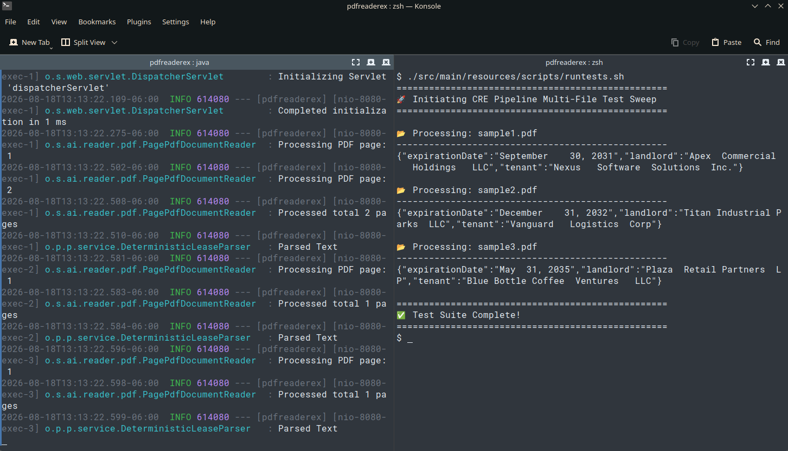
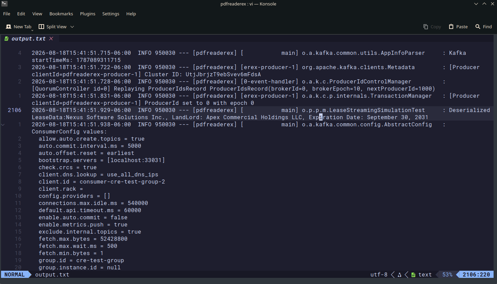

# CRE Lease Analytics Pipeline (cre-lease-analytics-pipeline)

A lightweight, deterministic, high-throughput ingestion pipeline designed to extract structural data from unstructured 
Commercial Real Estate (CRE) Triple-Net (NNN) lease agreements, map them to standard data schemas, and publish structured transactional events downstream.

# Why This Problem ?

In the Commercial Real Estate (CRE) industry, critical operational milestones, financial escalations, 
and risk management criteria are locked inside dense, unstructured PDF legal documents (Leases, Amendment Riders, Rent Rolls). 
Manually abstracting these elements introduces operational latency, human error, and massive data silos.

# Who It Serves ?

Asset Managers & Underwriters: Needs real-time visibility into financial cash flow steps and lease types across mixed-use property portfolios.
Property Operations / Compliance: Requires strict tracking of critical dates (e.g., Renewal deadlines) to prevent the loss of contractual options.

# Domain Research & Key Hypothesis

- **Hypothesis:** Unstructured lease PDFs can be parsed and normalized into a structured JSON format using deterministic extraction logic.
- **Key Entities:** Landlord, Tenant, Expiration Date, Lease Type (NNN/Gross), Escalation Clauses.

# Execution Steps V1

- Run the Spring Boot application

```shell
# On macOS / Linux (From project root directory, execute following command):
./mvnw spring-boot:run
```

# On Windows (Command Prompt):

```shell
mvnw.cmd spring-boot:run
```

- Run runtests.sh bash command (from inside src/main/resources/scripts/ directory) (to call the API for extracting relevant information from the PDF documents)

```shell
src/main/resources/scripts/runtest.sh                   
```

# Execution Step V2
Run jar directly.
```shell 
# 1. Package the codebase (skipping test sweeps for immediate launch)
./mvnw clean package -DskipTests

# 2. Run the production artifact directly via the JVM runtime
java -jar target/pdfreaderex-0.0.1-SNAPSHOT.jar
```

{width=40%}

# Classes
- PDFDocumentReader
  - Service to Read a PDF file and extracts text content using Apache PDFBox and returns list of Document objects
- DeterministicLeaseParser
  - Service to extract key information from the list of Document objects that was extracted using PDFDocumentReader
    - As an example, I am extracting information regarding Lanlord, Tenant and finally lease expiration date
- PDFReaderController uses above two services to read in the document name (examples are sample1, sample2, sample3), extract the text and return a JSON response with the captured fields
    - There are some duplicates here for the filename and passing them again. This is to simulate that we have list of file names, that is ready to be parsed (probably names can come from DB, Kafka event that this worker node reads etc.)
- LeaseData (model class) to capture the parsed information as an object

## Utility Clases
- PDFGeneratorUtility 
  - Apart from above core classes, I also have this utility class to generate simple PDFs to show variations in the documents. Although the first document is a free sample (not generated by this utility)
  - This utility can be run separately using TestPDFGeneratorUtilty

# Test Classes
- DeterministicLeaseParserTest: 
  - This is the main test class for the DeterministicLeaseParser. It reads in a sample PDF file and verifies the extracted fields

# Kafka
- I assumed we have the PDFs from some source. However, once we extract the necessary fields. I wanted to simulate the message is ready for further processing (can be used by various consumers)
- I use a simulated Kafka queue (as part of testing) that starts a lightweight Kafka broker, and verifies the message transfer through Kafka Producer/Consumer workflow
- The extracted object data is serialized into JSON, passed through Kafka queue, consumed by a consumer and deserialized back to LeaseData and verified the original data

To run the test, you can use following command
```shell
$ ./mvnw clean test
```

{width=40%}